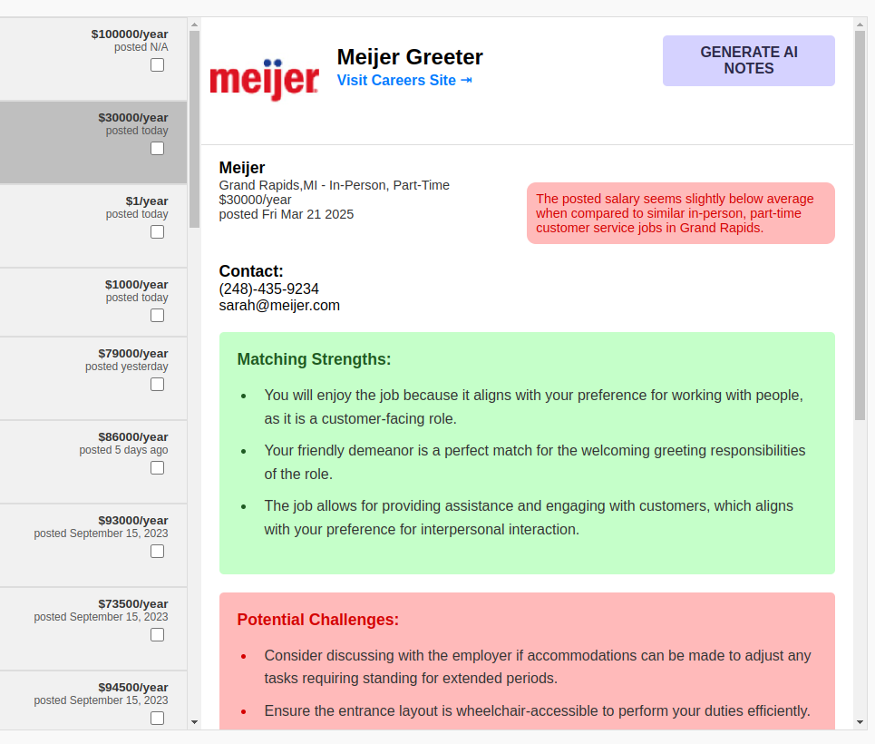

# Interstellar Jobs 🪐
We provide AI-powered job recommendations that connect people with disabilities or impairments to accessible employment opportunities.

Search a database of jobs posted by inclusive, accessible employers & receive personalized, AI-generated recommendations that highlight potential strengths and challenges based on individual characteristics.

## Features
🌟 **Landing Page**

The landing page describes the purpose of the project and the roles that Job Candidates, Job Coaches, and Employers play in facilitating accessible employment. It also provides guidance on how to use the AI features in the application, along with clear information about how user data will be used.

🌟 **Job Search Functionality for Job Coaches**

Our job board allows Job Coaches to search through a database of jobs using keywords related to a candidate’s interests. Filters can be applied based on relevant criteria such as salary, date posted, workplace type (e.g., remote or on-site), and employment type (e.g., full-time or part-time).

🌟 **AI Feedback on Job Fit**

Users can request AI-generated feedback based on the job description and their personal input, including job preferences and impairments. The system will provide personalized insights on potential strengths and challenges in the role, helping users identify positions that best match their unique abilities.

🌟 **AI Feedback on Salary Competitiveness**

The AI will also evaluate the listed salary for a role and indicate whether it is competitive based on the region and the type of work.

🌟 **Employer Job Submission & Resources**

Employers can submit accessible job listings through our "Add Job" form. This page also includes resources to help employers learn more about accessible employment practices.



## Software Stack
- Azure CosmosDB
- Azure OpenAI Service
- React
- TypeScript
- SCSS
- Python
- Flask

## Demo
    Insert link

## Environment Variables
In order to run this project, you will need to add the following information to your .env file in server/.env. These Azure services should be created:

Azure Services:

- [Azure Open AI Service with gpt-4o](https://portal.azure.com/#view/Microsoft_Azure_ProjectOxford/CognitiveServicesHub/~/OpenAI)
- [Optional - Azure CosmosDB for MongoDB](https://portal.azure.com/#browse/Microsoft.DocumentDB%2FmongoClusters)

The server/.env file format:
```
COSMOS_DB_URI=<Your path to Cosmos DB>
DATABASE_NAME=<Your Database name>

COMPLETIONS_AZURE_ENDPOINT=<Your Azure Completions Endpoint>
COMPLETIONS_API_KEY=<Your Azure Completions API Key>
COMPLETIONS_API_VERSION=2024-06-01
COMPLETIONS_MODEL=gpt-4o
```

## Local Run Instructions

Note: In order to run this project locally, you will need to setup Azure resources.

- First, make sure you are running at least [Node v22.14](https://nodejs.org/en/blog/release/v22.14.0) and [Python 3.12](https://www.python.org/downloads/release/python-3128/)
- This project uses a MongoDB database. We used an Azure CosmosDB for MongoDB cluster. Follow [these](https://www.mongodb.com/try/download/community) steps if you'd like to run Mongo locally.
- Download [MongoDB Compass](https://www.mongodb.com/try/download/compass) for a GUI experience.


Clone the project

```bash
  git clone https://github.com/zachpatrignani/microsoft-hackathon.git
```

Navigate to the /client directory

```bash
  npm install
  npm start
```

Navigate to the /server directory

```bash
  pip install -r requirements.txt
  python3 main.py
```
Navigate to MongoDB Compass
1.  Connect to your CosmosDB cluster or your localhost instance.
2.  Create a database, i.e. 'interstellar-jobs'
3.  Create a collection, i.e. 'jobs'
4.  Add Data -> Import JSON or CSV -> Select helping-hand.Jobs.json inside of server/utils/
5.  Verify you have 5500 jobs inserted.

## What's Next?
Our vision is bigger than our timeline. Here's some features we would love to implement in the future:

🌟 **Authentication & Profiles for Each User Type** 

Create authentication and profile management for three user types: Job Candidate, Job Coach, and Employer. Job Coaches should be able to create or manage profiles on behalf of their candidates, storing key information such as location, needs, interests, and resumes. This data would automatically feed into the AI job recommendation system.

🌟 **Job Coach Collaboration Tools** 

Enable Job Coaches to share Job Candidate profiles and notes. We aim to support every step of the employment process by providing Job Coaches with the tools needed for their candidates' success. This includes the ability to transfer candidate profiles to another coach if needed and to record notes during the employment journey. These notes can help inform future job matches.

🌟 **Employer Education for Accessible Employment** 

As part of our mission to promote inclusive employment, we want to provide employers with resources that support the integration of employees with disabilities. These materials will help ensure employers are informed, confident, and successful in creating accessible workplaces.

## Attribution
See the following attribution for images in client/public:
- planet.png [Saturn icons created by max.icons - Flaticon](https://www.flaticon.com/free-icons/saturn)
- ai_logo.png [Shine icons created by Freepik - Flaticon](https://www.flaticon.com/free-icons/shine)
- warning.png [Attention icons created by Andrean Prabowo - Flaticon](https://www.flaticon.com/free-icons/attention)
- planet.jpg, astronaut_dog.jpg, coach.jpg, employer.jpg [Images Designed by Freepik](https://www.freepik.com/)
